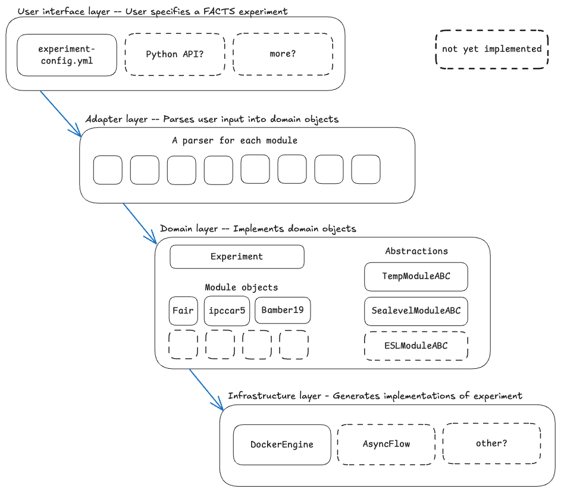

# facts-experiment-builder

This is a prototype of configuring and managing facts v2 experiments. 

Warning: it is very rough and incomplete! It currently has 2 modules implemented: fair and bamber19, and is only setup to generate global outputs, not local. 

## Overview



## Usage example:

Clone repo
```shell
git clone git@github.com:fact-sealevel/facts-experiment-builder.git
```

### Step 1: Create experiment
Then, create an experiment. To do this, you'll need to pass an experiment name and the modules you want to include in the experiment. The example below creates an experiment named <my_facts_experiment> that includes the fair and bamber19-icesheets modules. 

```shell
uv run setup-new-experiment my_facts_experiment fair bamber19-icesheets
```

If it runs sucessfully, it should show something like:
```shell
project_root: /Users/emmamarshall/Desktop/facts_work/facts_v2/facts-experiment-builder
✓ Created directory: /Users/emmamarshall/Desktop/facts_work/facts_v2/facts-experiment-builder/v2_experiments/my_facts_experiment
✓ Created data/v2_output_data directory
✓ Created v2-experiment-metadata.yml
✓ Created README.md

✨ Experiment directory setup complete!

Next steps:
  1. Edit /Users/emmamarshall/Desktop/facts_work/facts_v2/facts-experiment-builder/v2_experiments/my_facts_experiment/v2-experiment-metadata.yml
     - Fill in all placeholder values (pipeline-id, scenario, paths, etc.)
  2. Generate Docker Compose:
     uv run generate-compose /Users/emmamarshall/Desktop/facts_work/facts_v2/facts-experiment-builder/v2_experiments/my_facts_experiment
```

### Step 2: Configure experiment
Now, fill in the newly created `v2-experiment-metadata.yml` file. Some defaults will be pre-populated; these are taken from defaults specified in a `defaults.yml` file that is within the core submodule for each FACTS module. (eg. `./src/facts_experiment_builder/core/modules/fair/defaults.yml`).

A completed experiment metadata file looks like:
(note: this has hardcoded file paths from my computer, need to be changed)
```shell
experiment_name:
    my_facts_experiment
pipeline-id:
    "my_pipeline_id"
scenario:
    "ssp585"
baseyear:
    2005
pyear_start:
    2020
pyear_end:
    2150
pyear_step:
    10
nsamps:
    500
seed:
    1234
temp_module:
    fair
sealevel_modules:
    bamber19-icesheets
common-inputs-path:
    "$HOME/Desktop/facts_work/facts_v2/common_inputs_across_modules"
location-file:
    "location.lst"
v2-output-path:
    "./v2_experiments/my_facts_experiment/data/output"
fair:
  inputs:
    input_dir: $HOME/Desktop/facts_work/facts_v2/fair/data/input
    cyear_start: 1850
    cyear_end: 1900
    smooth_win: 19
    rcmip_fname: rcmip
    param_fname: parameters
  options:
    # Options are inherited from top-level metadata (pipeline-id, nsamps, seed, scenario)
    # Module-specific options are in inputs
  image: ghcr.io/fact-sealevel/fair-temperature:0.2.1
  outputs:
  - fair/climate.nc
  - fair/ohc.nc
  - fair/gsat.nc
  - fair/oceantemp.nc
bamber19-icesheets:
  inputs:
    input_dir: $HOME/Desktop/facts_work/facts_v2/bamber19-icesheets/data/input
    replace: true
    slr_proj_mat_file: SLRProjections190726core_SEJ_full.mat
    climate_data_file: fair/climate.nc
  options:
    # Options inherited from top-level metadata: pipeline-id, nsamps, seed, scenario, pyear_start, pyear_end, pyear_step, baseyear
    replace: true
  image: ghcr.io/fact-sealevel/bamber19-icesheets:0.1.0
  outputs:
  - bamber19-icesheets/ais_gslr.nc
  - bamber19-icesheets/eais_gslr.nc
  - bamber19-icesheets/wais_gslr.nc
  - bamber19-icesheets/gis_gslr.nc
```

### Step 3: Generate docker compose file

To generate a docker compose script with the specified experiment:
```shell
uv run generate-compose my_facts_experiment
```

### Step 4: Run compose file 

(note this doesn't work, need to fix a missing fair output file name and probably some other things)
