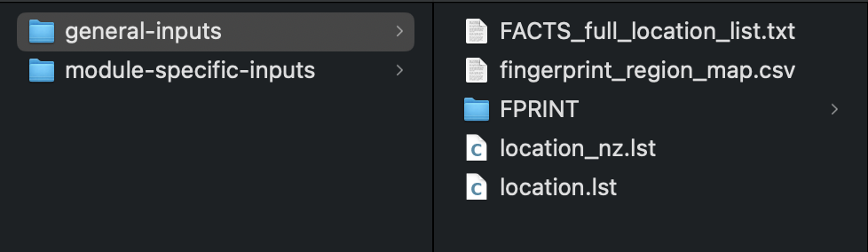
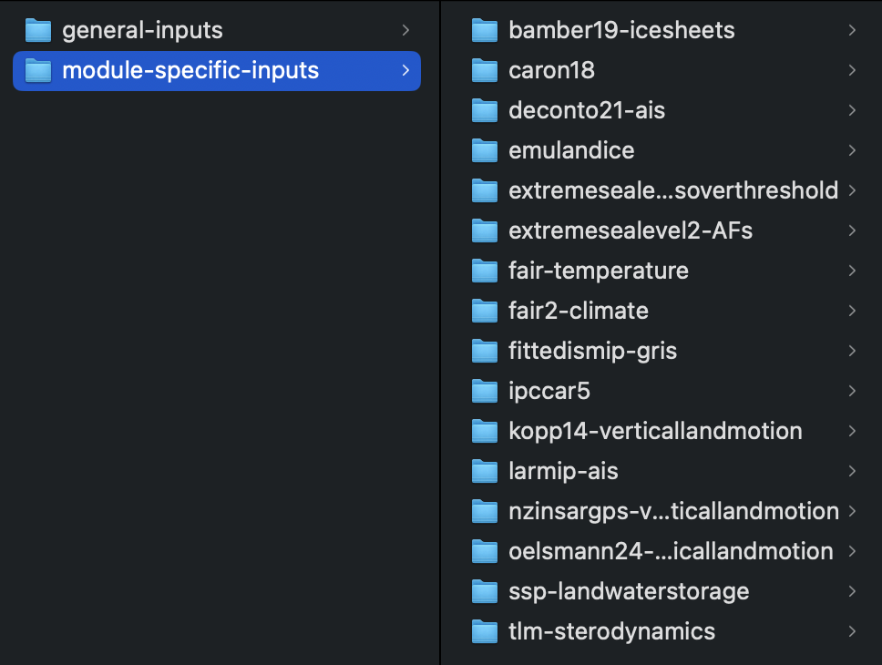
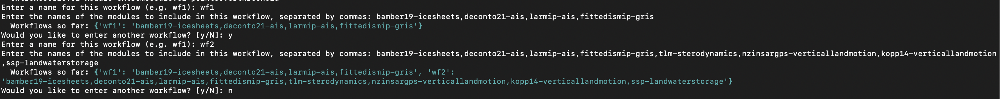
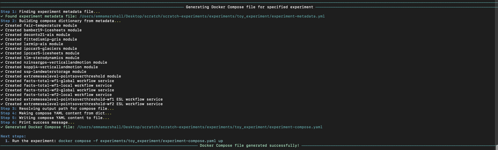

[](https://codecov.io/gh/fact-sealevel/facts-experiment-builder)

# facts-experiment-builder

> [!CAUTION]
> This is a prototype. It is likely to change in breaking ways, please don't rely on it in production and check back regularly for updates and new releases.

## Overview
This is a prototype of a package for configuring and managing FACTS 2 experiments. A FACTS 2 experiment consists of running one or more modules from the FACTS 2 ecosystem. It usually has a set of specified 'top-level parameters' that apply across all of the modules in the experiment. These can include parameters such as `nsamps`, `pyear-start`, `pyear-step`, `pyear-end`, `baseyear`, and `scenario`. Within an experiment, one can define multiple 'workflows`, these represent different combinations of sea-level modules to be summed to produce output distributions of projected future sea level rise. 

This package centers around physical artifacts, YAML files, and core in-memory representations of the artifacts. For example, an experiment is abstractly defined as a set of parameters, a collection of modules, and a list of workflows. This is serialized as an `experiment-metadata.yml` file and represented in-memory by the `FactsExperiment` class. 

Each containerized module application has a corresponding module yaml file (ie. `bamber19_icesheets_module.yaml` or `tlm_sterodynamics_module.yaml`) and a defaults yaml file (ie. `defaults_bamber19_icesheets.yml` or `defaults_tlm_sterodynamics.yml`). *Note: These yaml files are currently located in this repo, eventually they will be stored in the module repos.* The module yaml represents all of the inputs, outputs, and parameters used to specify that module as well as other critical metadata. In memory, this is stored as an object of the `FactsModule` class. The defaults file contains default values for any parameters in the module. 

To run a FACTS 2 experiment, we need more than the abstract information stored in an `experiment-metadata.yml`. `facts-experiment-builder` plans to offer implementations for multiple execution environments, with an experiment's `experiment-metadata.yml` remainining the underlying source of 'truth' about the experiment. From here, run files can be generated for specific execution environments such as Docker (`experiment-compose.yml`) and Async-Flow (`async-flow-experiment.py`, **not yet implemented**).

## Example
Warning: it is still rough! 
With the example experiment provided below, you should be able to run the two steps, `uv run setup-new-experiment` and `uv run generate-compose`, and then successfully execute the docker compose file to run the experiment. See toy_experiment's [experiment-metadata.yml](https://github.com/fact-sealevel/facts-experiment-builder/blob/main/experiments/toy_experiment/experiment-metadata.yml) and [experiment-compose.yml](https://github.com/fact-sealevel/facts-experiment-builder/blob/main/experiments/toy_experiment/experiment-compose.yaml) for examples of files created by the program.

### Steps to run:
#### 1. Setup
1. Start from your project root dir. For now, the experiment builder assumes you have an `experiments` sub-directory in this location. so something like...
```shell
mkdir -p fresh_facts_projects/experiments
cd fresh_facts_project
```
2. `facts-experiment-builder` assumes you have FACTS input data downloaded (anywhere on your machine) and separated into module-specific input data and general input data directories. See [setup.md](setup.md) for instructions on downloading the data.
- `module_specific_inputs` should have a sub-directory for each FACTS module with the directory name matching the module name.
- `general_input_data` contains `location.lst` and GRD fingerprint data.

- Example of input data directories:




#### 2. Create an experiment via CLI
- at a minimum, this entails specifying:
     - `--experiment-name`
     - `--climate-step` OR `--supplied-climate-step-data` (module name or path to pre-existing climate data)
     - `--sealevel-step` OR `--supplied-totaled-sealevel-step-data` (module name(s) or path to pre-existing sealevel data)
     - `--totaling-step` defaults to `facts-total`; pass `NONE` to skip (automatically skipped when `--supplied-totaled-sealevel-step-data` is used)
     - `--extremesealevel-step` (ie. `extremesealevel-pointsoverthreshold`)
     - For full features list, see help section below.

>[!NOTE]
> You can see which modules are available to use in an experiment by running `uv run list-modules`.

Example (standard run with all modules):
```shell
uvx --from git+https://github.com/fact-sealevel/facts-experiment-builder@main setup-new-experiment \
--experiment-name toy_experiment --pipeline-id aaa --scenario ssp585 \
--pyear-start 2020 --pyear-end 2100 --pyear-step 10 --baseyear 2005 --seed 1234 --nsamps 1000 \
--climate-step fair-temperature \
--sealevel-step bamber19-icesheets,deconto21-ais,fittedismip-gris,larmip-ais,ipccar5-glaciers,ipccar5-icesheets,tlm-sterodynamics,nzinsargps-verticallandmotion,kopp14-verticallandmotion \
--totaling-step facts-total \
--extremesealevel-step extremesealevel-pointsoverthreshold
```

Example (using pre-existing climate data instead of running a climate module):
```shell
uvx --from git+https://github.com/fact-sealevel/facts-experiment-builder@main setup-new-experiment \
--experiment-name toy_experiment_with_climate_data --scenario ssp585 \
--pyear-start 2020 --pyear-end 2100 --pyear-step 10 --baseyear 2005 --seed 1234 --nsamps 1000 \
--supplied-climate-step-data /path/to/climate_data.nc \
--sealevel-step bamber19-icesheets,tlm-sterodynamics \
--totaling-step facts-total \
--extremesealevel-step extremesealevel-pointsoverthreshold
```

- If `facts-total` is passed to `--totaling-step`, the CLI prompts the user for information about the workflows included in the experiment:

Once completed, the program:
     - Makes a sub-directory in experiments with the supplied `--experiment-name` 
     - Creates and partially pre-populates an `experiment-metadata.yml`. this is equivalent to a FACTS1 experiment `config.yml`. It is meant to be an abstract (run-environment agnostic), self-describing specification of the full experiment
     - `experiment-metadata.yml` is pre-populated based on the arguments you supply and the modules you specified
You will see the following output in your terminal window:


#### 3. Review and manually complete any empty fields in the top section of the experiment metadata file.

> [!NOTE]
> If you copy and paste the `setup-new-experiment` command above, pass the paths to your input data directories via `--module-specific-inputs` and `--general-inputs` (see [setup.md](setup.md)), or fill in those fields manually in the `experiment-metadata.yaml` that is created.

- If passed at the `uv run setup-new-experiment` step, values for `scenario`,`pyear-start/stop/step`,etc. will be prepopulated. if not, specify them here
- You shouldn't need to make any more edits to this file but you can review to see the full experiment specification before generating a compose file.

#### 4. Generate docker compose file via CLI
Example:
```shell
uvx --from git+https://github.com/fact-sealevel/facts-experiment-builder@main generate-compose \
--experiment-name toy_experiment
```
- Produces a docker compose file, `experiment-compose.yml` in the experiment sub-directory. 
- this is the docker implementation of the abstract experiment specified by `experiment-metadata.yml`



Then,
- Inspect the compose file
- Run experiment like (assuming from project root):
```shell
docker compose -f experiments/toy_experiment/experiment-compose.yaml up
```

**Not yet implemented: async-flow equivalent of `generate-compose`.**

## Features
This is a command line application with two main functions:

**`setup-new-experiment`**
Initialize a new experiment by calling this command and providing an experiment name and the modules (or pre-existing data) for each step. `facts-experiment-builder` creates a sub-directory to hold run files and outputs associated with this experiment. It also generates and prepopulates an `experiment-metadata.yml` based on the arguments provided by the user. The user must then enter any remaining fields in `experiment-metadata.yml` before it is considered complete.

Each step accepts either a module name or a path to pre-existing data:
- `--climate-step` / `--supplied-climate-step-data`: run a climate module or provide climate output directly
- `--sealevel-step` / `--supplied-totaled-sealevel-step-data`: run sealevel module(s) or provide sealevel output directly (totaling is automatically skipped when `--supplied-totaled-sealevel-step-data` is used)

```shell
uv run setup-new-experiment --help
Usage: setup-new-experiment [OPTIONS]

  Set up a new experiment with setup-new-experiment CLI command.

Options:
  --experiment-name TEXT         Name of the experiment  [required]
  --climate-step TEXT            Name of the temperature module
  --supplied-climate-step-data PATH       Path to data to use in place of running a
                                 module in the climate step of the experiment.
  --sealevel-step TEXT           Names of the sea level modules, separated by
                                 commas
  --supplied-totaled-sealevel-step-data PATH      Path to data to use in place of running
                                 modules in sea-level step
  --totaling-step TEXT           Name of the totaling step module (use 'NONE'
                                 if you do not want to call the totaling
                                 module)  [default: facts-total]
  --extremesealevel-step TEXT    Name of the extreme sea level module (use
                                 'NONE' if no extreme sea level module)
  --pipeline-id TEXT             Pipeline ID
  --scenario TEXT                Scenario
  --baseyear INTEGER             Base year
  --pyear-start INTEGER          Projection year start
  --pyear-end INTEGER            Projection year end
  --pyear-step INTEGER           Projection year step
  --nsamps INTEGER               Number of samples
  --seed INTEGER                 Random seed to use for sampling
  --location-file TEXT           Location file name
  --fingerprint-dir TEXT         Name of directory holding GRD fingerprint
                                 data
  --module-specific-inputs TEXT  Path to module-specific input data (written
                                 to experiment metadata)
  --general-inputs TEXT          Path to general input data (written to
                                 experiment metadata)
  -h, --help                     Show this message and exit.
```

**`generate-compose`**
From a completed `experiment-metadata.yml`, this command generates a Docker compose script that executes the experiment defined in the experiment metadata file. 

```shell
 uv run generate-compose --help                          
Usage: generate-compose [OPTIONS]

  Generate Docker Compose file from experiment metadata.

Options:
  --experiment-name TEXT     Name of the experiment (will look in experiments/
                             directory)  [required]
  --custom-output-path PATH  Output path for compose file. If not provided,
                             will use ../experiment_dir/experiment-
                             compose.yaml. If provided, must include full path
                             to file and use filename 'experiment-
                             compose.yaml'
  -h, --help                 Show this message and exit.
```

## Support

Source code is available online at https://github.com/fact-sealevel/facts-experiment-builder. This software is open source and available under the MIT license.

Please file issues in the issue tracker at https://github.com/fact-sealevel/facts-experiment-builder/issues.
