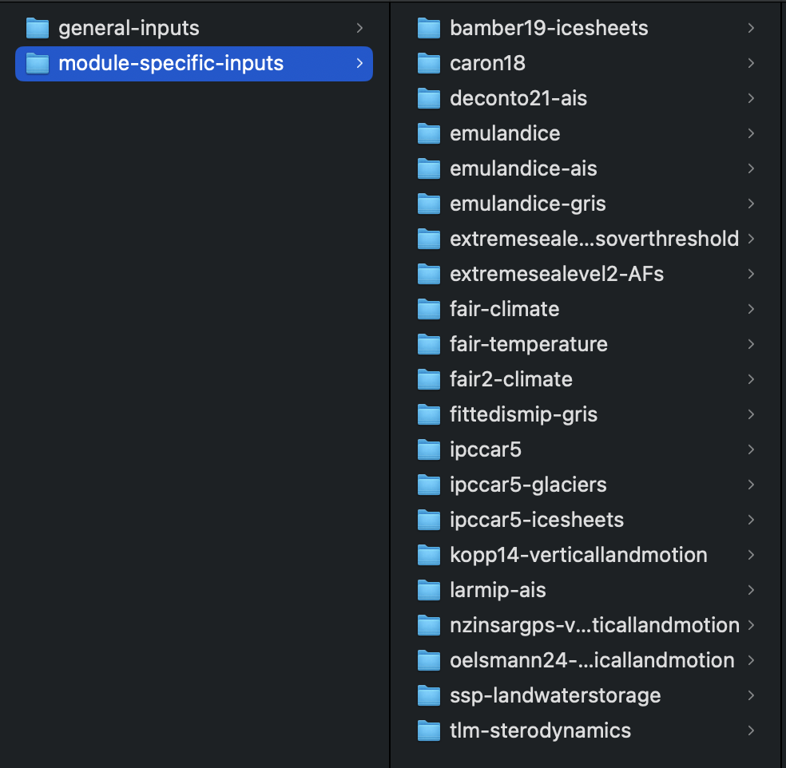
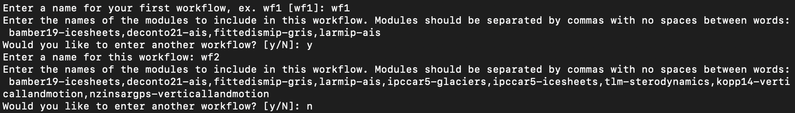
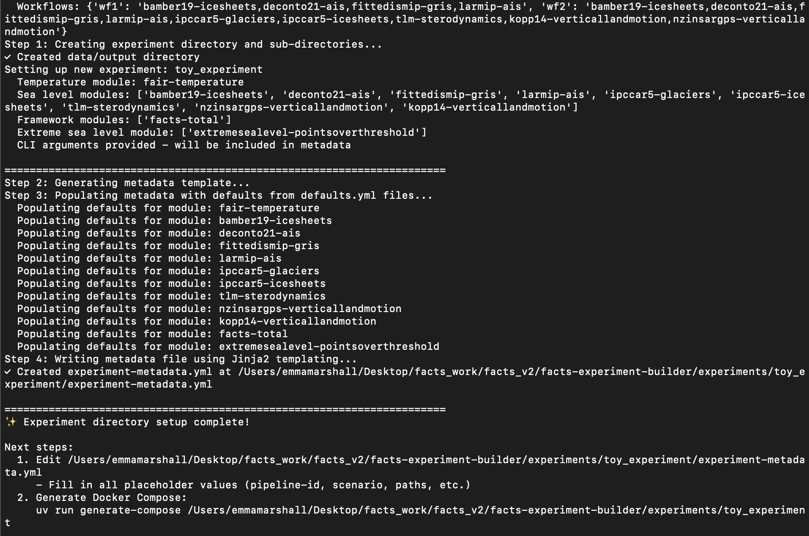
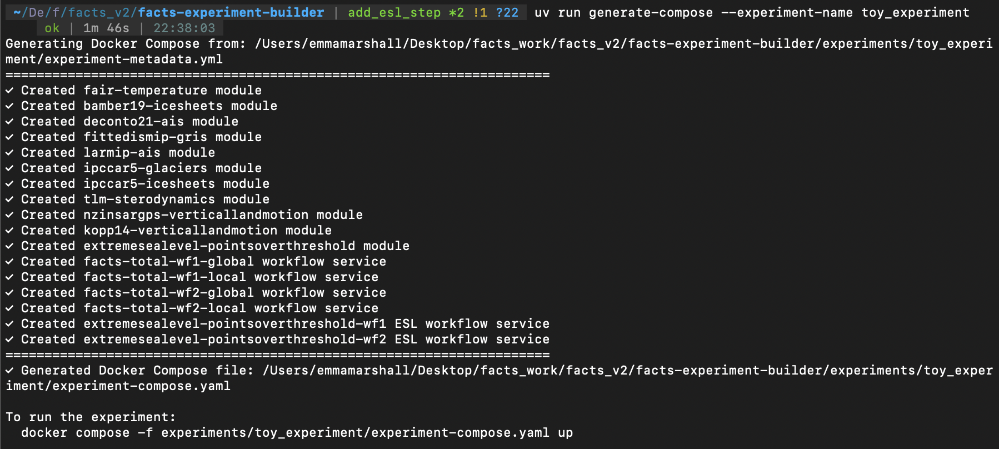

# Quickstart

This walkthrough runs a small toy experiment end-to-end.

## Prerequisites

- `uv` installed ([docs.astral.sh/uv](https://docs.astral.sh/uv/))
- FACTS input data downloaded and organized (see Step 1 below)
- Docker installed (to run the generated compose file)

---

## Step 1: Set up a project directory

`facts-experiment-builder` assumes you run commands from a **project root** that contains an `experiments/` subdirectory.

```shell
mkdir fresh_facts_project
cd fresh_facts_project
mkdir experiments
```

### Prepare input data

You need two directories of FACTS input data anywhere on your machine:

- **`module-specific-input-data/`** — one subdirectory per module, named after the module (e.g. `bamber19-icesheets/`, `tlm-sterodynamics/`)
- **`general-input-data/`** — contains `location.lst` and GRD fingerprint data

Example layouts:




---

## Step 2: Create an experiment

Run `setup-new-experiment` from your project root, specifying the modules for each step:

```shell
uvx --from git+https://github.com/fact-sealevel/facts-experiment-builder@main setup-new-experiment \
  --experiment-name toy_experiment \
  --pipeline-id aaa \
  --scenario ssp585 \
  --pyear-start 2020 --pyear-end 2100 --pyear-step 10 \
  --baseyear 2005 \
  --seed 1234 \
  --nsamps 1000 \
  --climate-step fair-temperature \
  --sealevel-step bamber19-icesheets,deconto21-ais,fittedismip-gris,larmip-ais,ipccar5-glaciers,ipccar5-icesheets,tlm-sterodynamics,nzinsargps-verticallandmotion,kopp14-verticallandmotion \
  --totaling-step facts-total \
  --extremesealevel-step extremesealevel-pointsoverthreshold
```

If `facts-total` is included as the `--totaling-step`, the CLI interactively prompts you to define your workflows:



Once complete, the tool:
- Creates `experiments/toy_experiment/`
- Writes a pre-populated `experiment-metadata.yml`



### Supplying pre-existing data instead of running a step

You can bypass one or more steps by providing pre-existing data instead of a module name:

**Skip the climate step** — provide a path to existing climate output (e.g. a FAIR output file):

```shell
uvx --from git+https://github.com/fact-sealevel/facts-experiment-builder@main setup-new-experiment \
  --experiment-name toy_experiment_with_climate_data \
  --scenario ssp585 --pyear-start 2020 --pyear-end 2100 --pyear-step 10 \
  --baseyear 2005 --seed 1234 --nsamps 1000 \
  --climate-step-data /path/to/climate_data.nc \
  --sealevel-step bamber19-icesheets,tlm-sterodynamics \
  --totaling-step facts-total \
  --extremesealevel-step extremesealevel-pointsoverthreshold
```

Sealevel modules that need climate data will automatically receive this path. No climate service is added to the compose file.

**Skip the climate and sealevel steps** — provide pre-computed totaled sea level data. The totaling step is automatically omitted too:

```shell
uvx --from git+https://github.com/fact-sealevel/facts-experiment-builder@main setup-new-experiment \
  --experiment-name toy_experiment_esl_only \
  --scenario ssp585 --pyear-start 2020 --pyear-end 2100 --pyear-step 10 \
  --baseyear 2005 --seed 1234 --nsamps 1000 \
  --supplied-totaled-sealevel-data /path/to/totaled_sealevel.nc \
  --extremesealevel-step extremesealevel-pointsoverthreshold
```

---

## Step 3: Complete the experiment metadata

Open `experiments/toy_experiment/experiment-metadata.yml` and fill in any empty fields, particularly:

- `module-specific-inputs` — path to your module-specific input data directory
- `general-inputs` — path to your general input data directory

!!! note
    If you passed `--module-specific-inputs` and `--general-inputs` to `setup-new-experiment`, these will already be filled in.

Other top-level fields (`scenario`, `pyear-start`, etc.) will already be populated if you passed them as CLI arguments.

---

## Step 4: Generate the Docker Compose file

```shell
uvx --from git+https://github.com/fact-sealevel/facts-experiment-builder@main generate-compose \
  --experiment-name toy_experiment
```

This reads `experiments/toy_experiment/experiment-metadata.yml` and writes `experiments/toy_experiment/experiment-compose.yaml`.



---

## Step 5: Run the experiment

```shell
docker compose -f experiments/toy_experiment/experiment-compose.yaml up
```
