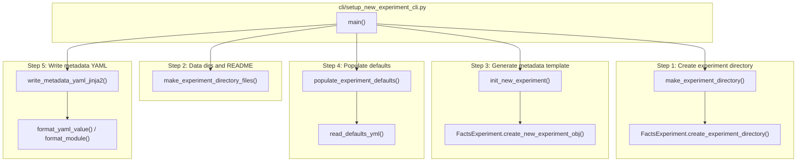

# Command Flow

!!! note "This page is for codebase contributors"
    This is for developers modifying the experiment builder itself. If you want to add a new module, see [Adding a Module](../contributing/adding-a-module.md). If you just want to run experiments, see the [User Guide](../user-guide/overview.md).

This document describes what is called when you run `setup-new-experiment` and `generate-compose`, with Mermaid diagrams for each.

---

## 1. setup-new-experiment

**Entry point:** `facts_experiment_builder.cli.setup_new_experiment_cli:main`
**Application module:** `facts_experiment_builder.application.setup_new_experiment`

The CLI parses options (experiment-name, temperature-module, sealevel-modules, pipeline-id, scenario, etc.), then runs five steps in order.

**Step summary**

| Step | Function | Role |
|------|----------|------|
| 1 | `make_experiment_directory(experiment_name)` | Delegates to `FactsExperiment.create_experiment_directory`; creates `experiments/<experiment_name>/`. |
| 2 | `make_experiment_directory_files(experiment_path, module_names)` | Delegates to `FactsExperiment.create_experiment_directory_files`; creates `data/output/`, optional README. |
| 3 | `init_new_experiment(...)` | Builds a `FactsExperiment` via `FactsExperiment.create_new_experiment_obj` (top-level params, manifest, paths, fingerprint params, module sections from module YAMLs). |
| 4 | `populate_experiment_defaults(experiment, module_name)` | For each module: loads defaults from `defaults_*.yml`, merges into experiment via `experiment.merge_defaults_for_module`. |
| 5 | `write_metadata_yaml_jinja2(experiment, output_path)` | Renders `YAML_TEMPLATE` with Jinja2; uses `format_yaml_value()` and `format_module()`; writes `experiment-metadata.yml`. |

**Key dependencies**

- `utils.path_utils`: `find_project_root`
- `core.module`: `FactsModule`, `load_facts_module_by_name`
- `core.experiment`: `FactsExperiment`
- `resources`: `get_module_configs_dir` (via `get_module_defaults_path`)

---

## 2. generate-compose

**Entry point:** `facts_experiment_builder.cli.generate_compose_cli:main`
**Application module:** `facts_experiment_builder.application.generate_compose`

The CLI resolves the experiment dir and metadata path, calls `generate_compose_from_metadata(metadata_path)`, then formats the YAML and writes the compose file.

```mermaid
flowchart TB
    subgraph CLI["cli/generate_compose_cli.py"]
        main["main()"]
    end

    find_root["find_project_root()"]
    gen_compose["generate_compose_from_metadata(metadata_path)"]
    format_compose["format_compose_yaml()"]
    write_file["write experiment-compose.yaml"]

    main --> find_root
    main --> gen_compose
    main --> format_compose
    main --> write_file

    subgraph Load["Load and manifest"]
        load_meta["load_metadata(metadata_path)"]
        facts_exp["FactsExperiment.from_metadata_dict(metadata)"]
        manifest["manifest (temperature_module, sealevel_modules, ...)"]
        load_meta --> facts_exp
        facts_exp --> manifest
    end

    subgraph Adapter["Adapter: build module specs"]
        create_mod["create_module_from_metadata() per module"]
        build_spec["build_module_service_spec()"]
        create_mod --> build_spec
    end

    subgraph BuildSpec["build_module_service_spec (generic_module_parser)"]
        find_yaml["find_module_yaml_path()"]
        load_facts["load_facts_module()"]
        get_paths["get_experiment_paths()"]
        expand["expand_path()"]
        resolve_in["resolve_input_path()"]
        resolve_out["resolve_output_path()"]
        build_paths["build_module_input_paths() / build_module_output_paths()"]
        mk_components["ModuleServiceSpecComponents"]
        mk_spec["ModuleServiceSpec(components, module_definition)"]
        find_yaml --> load_facts
        build_spec --> get_paths
        build_spec --> expand
        build_spec --> resolve_in
        build_spec --> resolve_out
        build_spec --> build_paths
        build_spec --> mk_components
        build_spec --> mk_spec
    end

    subgraph Compose["Compose service per module"]
        gen_service["module.generate_compose_service()"]
        build_cmd["_build_command_args()"]
        build_vol["_build_volumes()"]
        build_dep["_build_depends_on()"]
        build_dict["build_service_dict() (compose_service_writer)"]
        gen_service --> build_cmd
        gen_service --> build_vol
        gen_service --> build_dep
        gen_service --> build_dict
    end

    gen_compose --> load_meta
    gen_compose --> facts_exp
    gen_compose --> create_mod
    gen_compose --> gen_service
```

**Step summary**

| Step | What runs | Role |
|------|------------|------|
| 1 | `load_metadata(metadata_path)` | Loads `experiment-metadata.yml` (YAML). |
| 2 | `FactsExperiment.from_metadata_dict(metadata)` | Builds experiment model; `manifest` has `temperature_module`, `sealevel_modules`, etc. |
| 3 | `create_module_from_metadata(metadata_path, module_name, module_type, metadata)` | For each temp, sealevel, framework, and ESL module. |
| 4 | `build_module_service_spec(metadata, experiment_dir, module_name, ...)` | Resolves module YAML path, loads `FactsModule`, gets experiment paths, expands and resolves inputs/outputs, builds `ModuleServiceSpecComponents` and `ModuleServiceSpec`. |
| 5 | `module.generate_compose_service(temperature_service_name)` | For each module: builds command args, volumes, depends_on; delegates to `build_service_dict()` (compose_service_writer); returns one compose service dict. |
| 6 | `compose_dict = {"services": services}` | All service dicts combined. |
| 7 | `yaml.dump()` then `format_compose_yaml()` | Serializes and formats; CLI writes to `experiment-compose.yaml`. |

**Key dependencies**

- `utils.path_utils`: `find_project_root`, `expand_path`, `resolve_input_path`, `resolve_output_path`, `build_module_input_paths`, `build_module_output_paths`
- `adapters.module_adapter`: `load_metadata`, `create_module_from_metadata`
- `adapters.generic_module_parser`: `build_module_service_spec`
- `adapters.adapter_utils`: `get_required_field`, `get_experiment_paths`
- `adapters.module_implementation`: `ModuleServiceSpec`, `ModuleServiceSpecComponents`, `generate_compose_service`
- `adapters.compose_service_writer`: `build_service_dict`
- `adapters.source_resolver`: `resolve_value`
- `core.module`: `find_module_yaml_path`, `load_facts_module`
- `core.experiment`: `FactsExperiment`
